# 《redis实战》学习笔记

## rdb快照存储


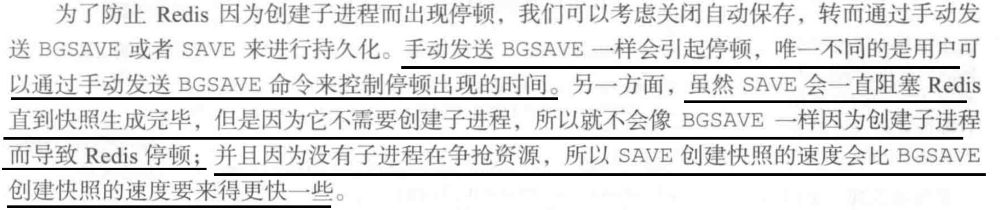

## aof日志存储

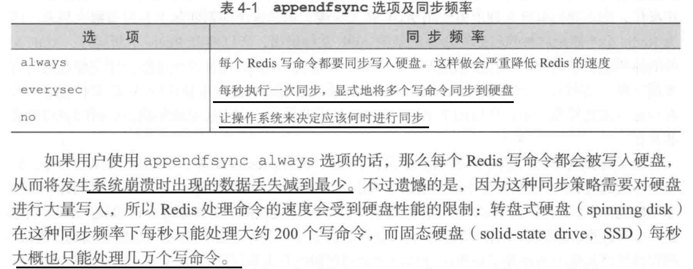


## redis主从架构的原因

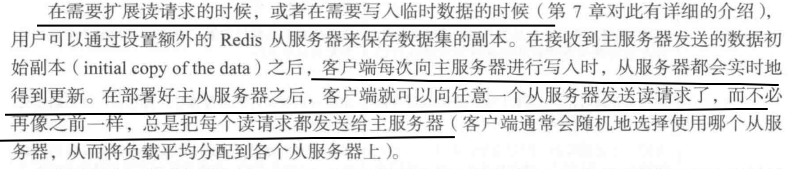

## redis主从复制过程

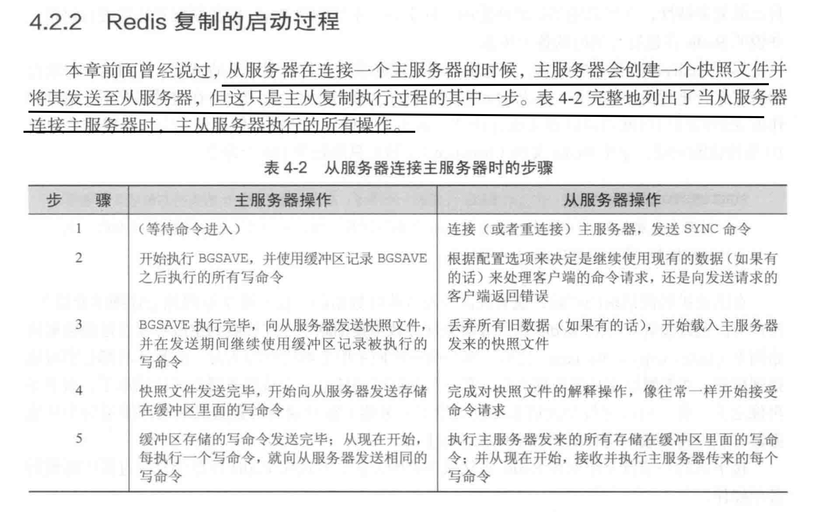


## 一般redis主从同步需要做那些设置

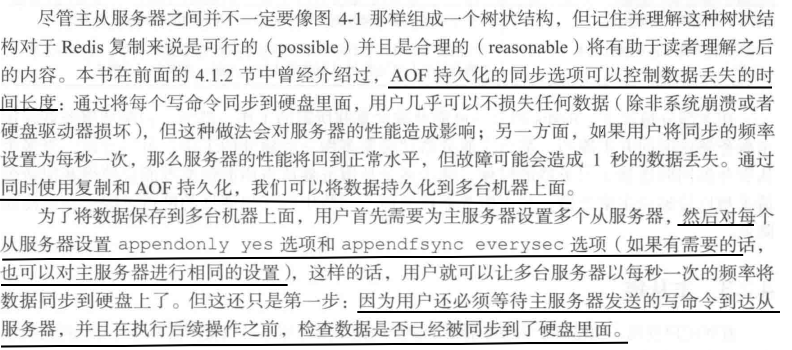

## redis事务

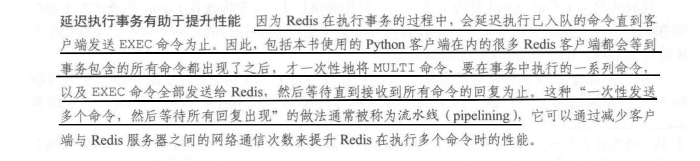

## redis watch加的是乐观锁，传统的关系型数据库加的是悲观锁

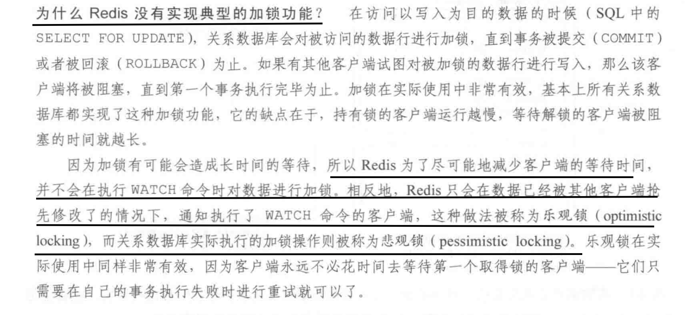

## 非事务型流水线

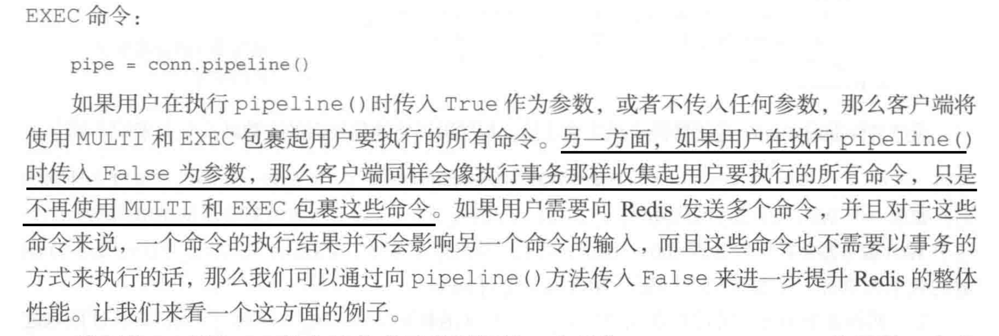

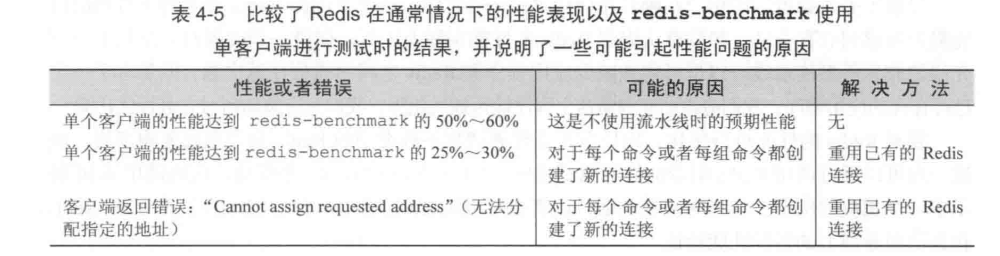

## redis做分布式锁需要注意的地方

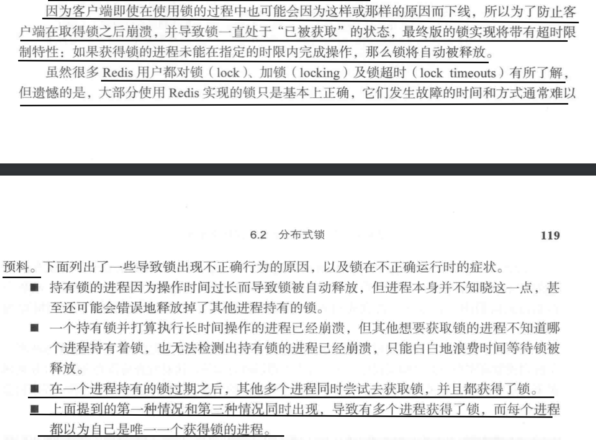

## 使用redis构建锁

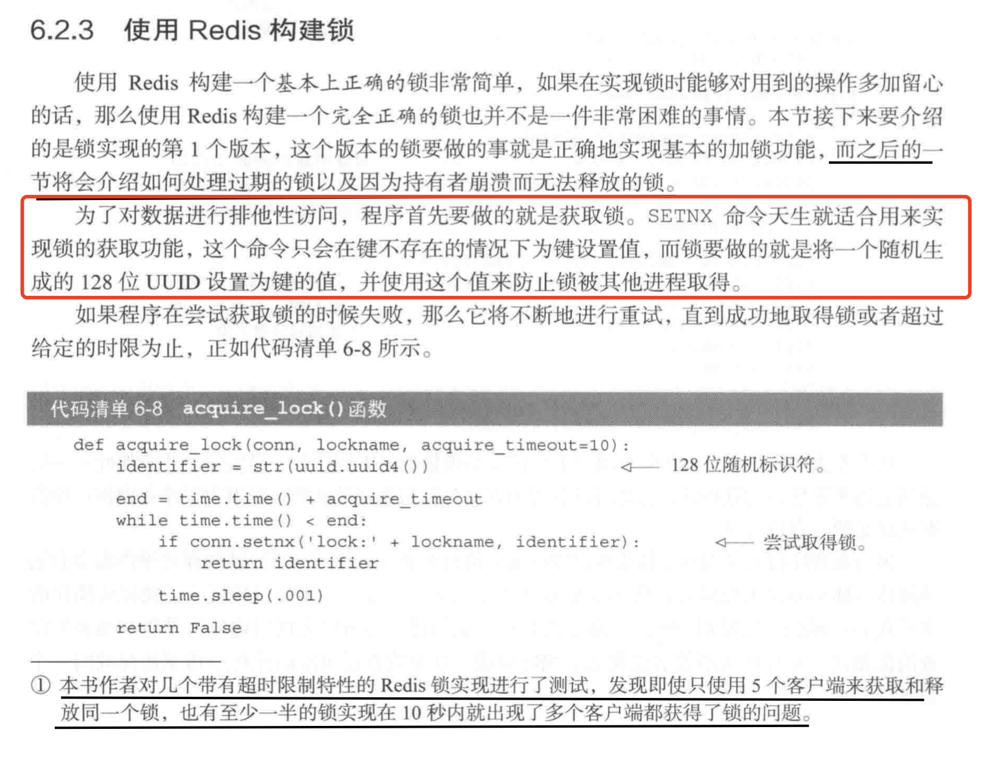

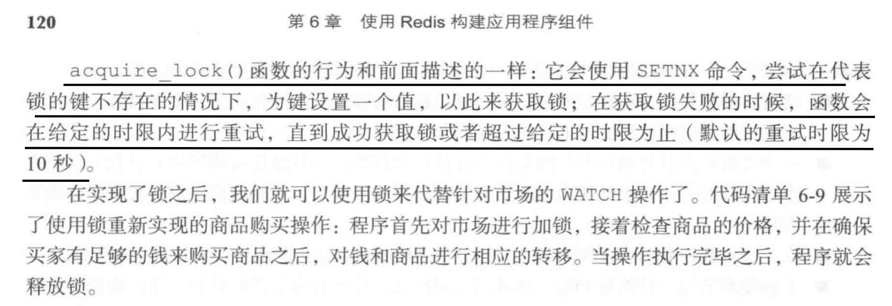

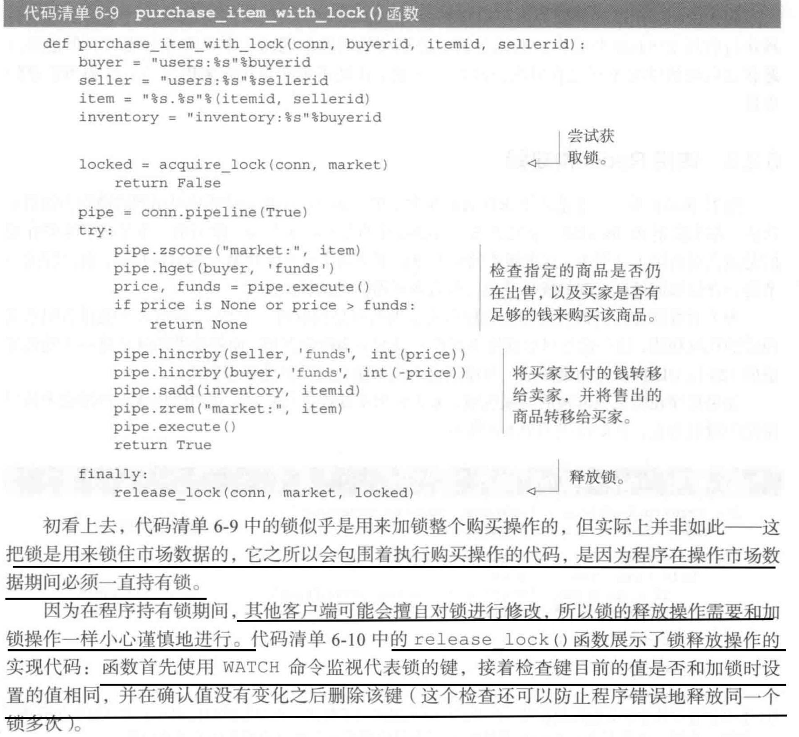

**创建锁的时候，将锁的值设置为一个 uuid，解锁的时候判断当前的lockname对应的uuid是否发生了改变，防止当前线程删除其他线程创建的锁。**

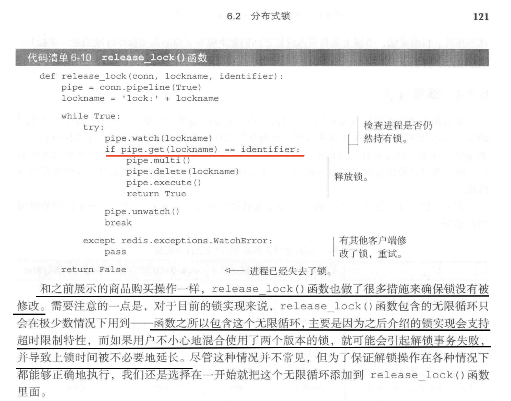

## 带有超时时间特性的锁

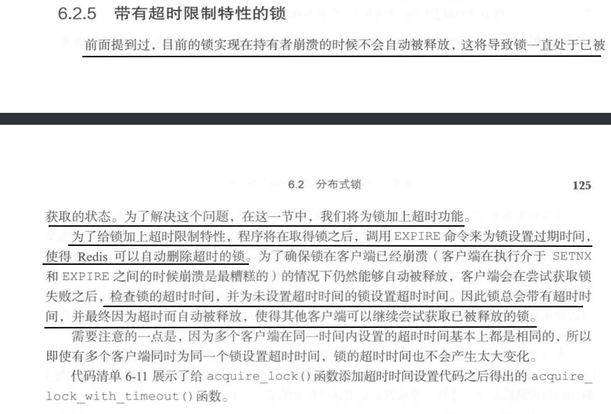

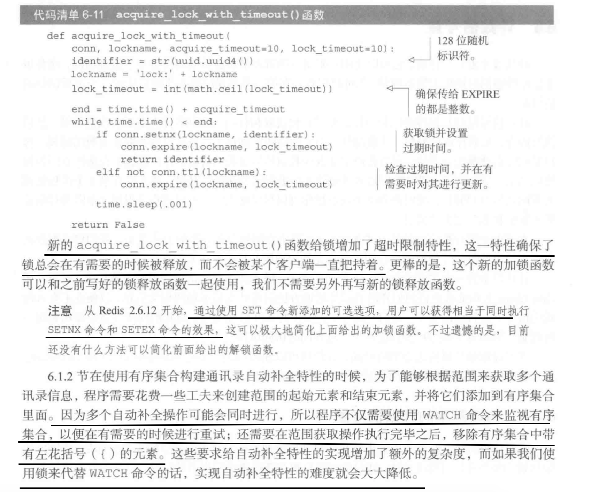

# redis学习记录

## [Redis中setex与setnx的区别？](https://blog.csdn.net/weixin_44774355/article/details/104425535)

>setex：
>setex key seconds value：将key值设置为value，并将设置key的生存周期
>1，属于原子操作，作用和set key value、expire key seconds作用一致。
>2，如果key值存在，使用setex将覆盖原有值.
>setnx:
>setnx key value:只有当key不存在的情况下，将key设置为value；若key存在，不做任何操作，结果成功返回1，失败返回0.

## [Redis Zadd 命令](https://www.runoob.com/redis/sorted-sets-zadd.html)

>如果某个成员已经是有序集的成员，那么更新这个成员的分数值，并通过重新插入这个成员元素，来保证该成员在正确的位置上。
>
>分数值可以是整数值或双精度浮点数。
>
>如果有序集合 key 不存在，则创建一个空的有序集并执行 ZADD 操作。
>
>返回值:
>
>被成功添加的新成员的数量，不包括那些被更新的、已经存在的成员。

## [redis 单线程的理解](https://www.cnblogs.com/myseries/p/11733861.html)

>**单线程模型**
>
>　　Redis 客户端对服务端的每次调用都经历了发送命令，执行命令，返回结果三个过程。其中执行命令阶段，**由于Redis是单线程来处理命令的，所有每一条到达服务端的命令不会立刻执行，所有的命令都会进入一个队列中，然后逐个被执行。**并且多个客户端发送的命令的执行顺序是不确定的。**但是可以确定的是不会有两条命令被同时执行，不会产生并发问题**，这就是Redis的单线程基本模型。
>
>**1. redis单线程问题**
>
>　　单线程指的是网络请求模块使用了一个线程（所以不需考虑并发安全性），即一个线程处理所有网络请求，其他模块仍用了多个线程。
>
>**2. 为什么说redis能够快速执行**
>
>(1) 绝大部分请求是纯粹的内存操作（非常快速）
>
>(2) 采用单线程,避免了不必要的上下文切换和竞争条件
>
>(3) 非阻塞IO - IO多路复用，Redis采用epoll做为I/O多路复用技术的实现，再加上Redis自身的事件处理模型将epoll中的连接，读写，关闭都转换为了时间，不在I/O上浪费过多的时间。
>
>　　**Redis采用单线程模型，每条命令执行如果占用大量时间，会造成其他线程阻塞，对于Redis这种高性能服务是致命的，所以Redis是面向高速执行的数据库。**

## [Redis分布式锁/Redis的setnx命令如何设置key的失效时间（同时操作setnx和expire）](https://www.cnblogs.com/smallleiit/p/13530602.html)

>`Redis`的`setnx`命令是当`key`不存在时设置`key`，但`setnx`不能同时完成`expire`设置失效时长，不能保证`setnx`和`expire`的原子性。我们可以使用`set`命令完成`setnx`和`expire`的操作，并且这种操作是原子操作。
>下面是`set`命令的可选项：
>
>
>
> 从上面可以看出，多个命令放在同一个`redis`连接中并且`redis`是单线程的，因此上面的操作可以看成`setnx`和`expire`的结合体，是原子性的。
>
>

## [Java基于redis实现分布式锁(SpringBoot)](https://www.cnblogs.com/happy4java/p/11205993.html)

># **实现**
>
>新建一个DistributedLock.class，注入StringRedisTemplate。
>
>```java
>@Component
>public class DistributedLock {
>
> @Autowired
> private StringRedisTemplate redisTemplate;
>
>}
>```
>
>**获得锁**
>
>```java
>/**
> * 获得锁
> */
> public boolean getLock(String lockId, long millisecond) {
> Boolean success = redisTemplate.opsForValue().setIfAbsent(lockId, "lock",
> millisecond, TimeUnit.MILLISECONDS);
> return success != null && success;
> }
>```
>
>setIfAbsent 方法，就是当键不存在的时候，设置，并且该方法可以设置键的过期时间。该方法对应到redis的原生命令就是：
>
>```shell
>SET lockId content PX millisecond NX 
>```
>
>至于设置多少的过期时间合适，这个是没有定论的，需要根据真是的业务场景来衡量。
>
>**释放锁**
>
>当处理完业务逻辑后，需要手动的把锁释放掉。
>
>```java
> public void releaseLock(String lockId) {
> redisTemplate.delete(lockId);
> }
>```
>
>释放锁的操作比较简单，直接删除之前设置的键即可。其实，基于redis实现分布式锁的方式，在释放锁的时候，是存在释放失败的风险的（比如网路抖动什么的），这也是为什么在设置锁的时候需要设置过期时间的原因，可以防止在出现异常的时候，锁会自动的消失掉。同时，我们也可以增加几次失败之后的重试机制。
>
># **测试**
>
>新建一个BusinessTask.java，代码如下：
>
>```java
>@Component
>public class BusinessTask {
>
> private final static String LOCK_ID = "happyjava";
>
> @Autowired
> DistributedLock distributedLock;
>
> @Scheduled(cron = "0/10 * * * * ? ")
> public void doSomething() {
> boolean lock = distributedLock.getLock(LOCK_ID, 10 * 1000);
> if (lock) {
> System.out.println("执行任务");
> distributedLock.releaseLock(LOCK_ID);
> } else {
> System.out.println("没有抢到锁");
> }
> }
>
>}
>```
>
>这里使用了springboot的Scheduled注解来实现定时任务，该cron表达式的意思是每10秒钟，执行一次任务，然后我们启动两次该项目，观察一段时间执行结果：
>
>第一个springboot任务：
>
>
>
>第二个springboot任务：
>
>
>
>两个任务在交替的执行任务，证明了同一时刻只有一个应用持有了锁。

## [详解 Jedis 的 SCAN、SSCAN、HSCAN、ZSCAN 用法](https://www.xttblog.com/?p=3635)

>SCAN、SSCAN、HSCAN、ZSCAN 4 个命令，分别用于集合、哈希键及有序集等。
>
>- SCAN：命令用于迭代当前数据库中的数据库键。
>- SSCAN：命令用于迭代集合键中的元素。
>- HSCAN：命令用于迭代哈希键中的键值对。
>- ZSCAN：命令用于迭代有序集合中的元素（包括元素成员和元素分值）。
>
>命令格式如下：
>
>```shell
>SCAN cursor [MATCH pattern] [COUNT count]
>```
>
>scan 游标 MATCH <返回和给定模式相匹配的元素> count 每次迭代所返回的元素数量 SCAN 命令是增量的循环，每次调用只会返回一小部分的元素。所以不会有 KEYS 命令的坑(key 的数量比较多，一次 KEYS 查询会 block 其他操作)。
>
>在 Redis 中的具体用法如下：
>
>```shell
>scan 0 match xttblog.com* count 5 
>sscan myset 0 match 业余草*
>```
>

## [Redis热点数据如何处理](https://blog.csdn.net/fuqianming/article/details/99682764)

>怎么发现热 key
>方法一:凭借业务经验，进行预估哪些是热key
>其实这个方法还是挺有可行性的。比如某商品在做秒杀，那这个商品的key就可以判断出是热key。缺点很明显，并非所有业务都能预估出哪些key是热key。
>
>方法二:在客户端进行收集
>这个方式就是在操作redis之前，加入一行代码进行数据统计。那么这个数据统计的方式有很多种，也可以是给外部的通讯系统发送一个通知信息。缺点就是对客户端代码造成入侵。
>
>方法三:在Proxy层做收集
>有些集群架构是下面这样的，Proxy可以是Twemproxy，是统一的入口。可以在Proxy层做收集上报，但是缺点很明显，并非所有的redis集群架构都有proxy。
>
>方法四:用redis自带命令
>(1)monitor命令，该命令可以实时抓取出redis服务器接收到的命令，然后写代码统计出热key是啥。当然，也有现成的分析工具可以给你使用，比如redis-faina。但是该命令在高并发的条件下，有内存增暴增的隐患，还会降低redis的性能。
>(2)hotkeys参数，redis 4.0.3提供了redis-cli的热点key发现功能，执行redis-cli时加上–hotkeys选项即可。但是该参数在执行的时候，如果key比较多，执行起来比较慢。
>
>方法五:自己抓包评估
>Redis客户端使用TCP协议与服务端进行交互，通信协议采用的是RESP。自己写程序监听端口，按照RESP协议规则解析数据，进行分析。缺点就是开发成本高，维护困难，有丢包可能性。
>
>以上五种方案，各有优缺点。根据自己业务场景进行抉择即可。那么发现热key后，如何解决呢？
>
>如何解决
>目前业内的方案有两种
>
>(1)利用二级缓存
>比如利用ehcache，或者一个HashMap都可以。在你发现热key以后，把热key加载到系统的JVM中。
>针对这种热key请求，会直接从jvm中取，而不会走到redis层。
>假设此时有十万个针对同一个key的请求过来,如果没有本地缓存，这十万个请求就直接怼到同一台redis上了。
>现在假设，你的应用层有50台机器，OK，你也有jvm缓存了。这十万个请求平均分散开来，每个机器有2000个请求，会从JVM中取到value值，然后返回数据。避免了十万个请求怼到同一台redis上的情形。
>
>(2)备份热key
>这个方案也很简单。不要让key走到同一台redis上不就行了。我们把这个key，在多个redis上都存一份不就好了。接下来，有热key请求进来的时候，我们就在有备份的redis上随机选取一台，进行访问取值，返回数据。
>假设redis的集群数量为N，步骤如下图所示
>
>注:不一定是2N，你想取3N，4N都可以，看要求。
>伪代码如下
>
>```java
>const M = N * 2
>//生成随机数
>random = GenRandom(0, M)
>//构造备份新key
>bakHotKey = hotKey + “_” + random
>data = redis.GET(bakHotKey)
>if data == NULL {
>    data = GetFromDB()
>    redis.SET(bakHotKey, expireTime + GenRandom(0,5))
>}
>```
>
>

## [两个Redis集群 如何平滑数据迁移?](https://zhuanlan.zhihu.com/p/90445769) 

>## 02 方案汇总
>
>### （1）基于 redis 自身的RDB/AOF 备份机制
>
>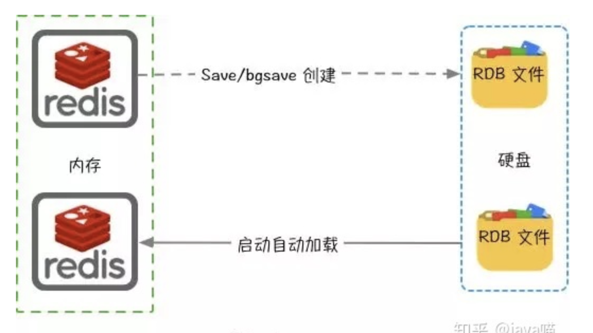
>
>1. 执行 `save\bgsave` 触发数据持久化 `RDB`文件
>2. 拷贝redis备份文件（dump.rdb）到目标机器
>3. 重启目标实例重新`load` RDB 文件
>
>- 关于 save/bgsave 的区别
>
>
>
>### （2）基于 `redis-dump`导入导出 `json`备份
>
>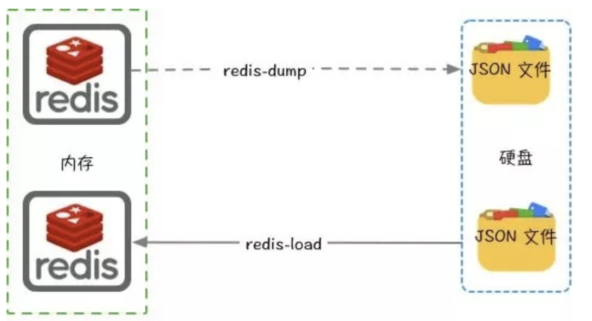
>
>```shell
># 导出命令
>redis-dump –u 127.0.0.1:6379 > lengleng.json
># 导出指定数据库数据
>redis-dump -u 127.0.0.1:6379 -d 15 > lengleng.json
># 如果redis设有密码
>redis-dump –u :password@127.0.0.1:6379 > lengleng.json
>
># 导入命令
>< lengleng.json redis-load
># 指定redis密码
>< lengleng.json redis-load -u :password@127.0.0.1:6379
>```
>
>### （3）基于 `redis-shake` 实现 `redis-cluster` 迁移
>
>

# Redis 日常学习专题

## redis单线程原理

>redis单线程问题
>
>单线程指的是网络请求模块使用了一个线程（所以不需考虑并发安全性），即一个线程处理所有网络请求，其他模块仍用了多个线程。
>
>**1. 为什么说redis能够快速执行**
>
>(1) 绝大部分请求是纯粹的内存操作（非常快速）
>
>(2) 采用单线程,避免了不必要的上下文切换和竞争条件
>
>(3) 非阻塞IO - IO多路复用
>
>**2. redis的内部实现**  (什么是 epoll)
>
>​	内部实现采用 epoll，采用了epoll+自己实现的简单的事件框架。epoll中的读、写、关闭、连接都转化成了事件，然后利用epoll的多路复用特性，绝不在io上浪费一点时间 这3个条件不是相互独立的，特别是第一条，如果请求都是耗时的，采用单线程吞吐量及性能可想而知了。应该说redis为特殊的场景选择了合适的技术方案。
>
>**3. Redis关于线程安全问题**
>
>redis实际上是采用了线程封闭的观念，把任务封闭在一个线程，自然避免了线程安全问题，不过对于需要依赖多个redis操作的复合操作来说，依然需要锁，而且有可能是分布式锁。
>
>**4. IO多路复用**
>
>那这样子，在读取socket1的数据时，如果其它socket有数据来，那么也要等到socket1读取完了才能继续读取其它socket的数据吧。那不是也阻塞住了吗？而且读取到的数据也要开启线程处理吧，那这和多线程IO有什么区别呢？  （不懂问的什么）
>
>A:1.CPU本来就是线性的不论什么都需要顺序处理,并行只能是多核CPU.
>
>​	2.io多路复用本来就是用来解决对多个I/O监听时,一个I/O阻塞影响其他I/O的问题,这个过程是单线程的，跟多线程没关系.
>
>​	3.跟多线程相比较,线程切换需要切换到内核进行线程切换,需要消耗时间和资源.而I/O多路复用不需要切换线/进程,效率相对较高,特别是对高并发的应用nginx就是用I/O多路复用,故而性能极佳.但多线程编程逻辑和处理上比I/O多路复用简单.而I/O多路复用处理起来较为复杂.
>
>**5. 使用Redis有哪些好处？**
>
>(1) 速度快，因为数据存在内存中，类似于HashMap，HashMap的优势就是查找和操作的时间复杂度都是O(1)。
>
>(2) 支持丰富数据类型，支持string，list，set，sorted set，hash。
>
>(3) 支持事务，操作都是原子性，所谓的原子性就是对数据的更改要么全部执行，要么全部不执行。
>
>(4) 丰富的特性：可用于缓存，消息，按key设置过期时间，过期后将会自动删除
>
>**6. Redis相比memcached有哪些优势？**
>
>(1) memcached所有的值均是简单的字符串，redis作为其替代者，支持更为丰富的数据类型
>
>(2) redis的速度比memcached快很多
>
>(3) redis可以持久化其数据
>
>(4)Redis支持数据的备份，即master-slave模式的数据备份。
>
>(5) 使用底层模型不同，它们之间底层实现方式 以及与客户端之间通信的应用协议不一样。Redis直接自己构建了VM 机制 ，因为一般的系统调用系统函数的话，会浪费一定的时间去移动和请求。
>
>(6）value大小：redis最大可以达到1GB，而memcache只有1MB
>
>**7. Redis常见性能问题和解决方案：**（理解不深刻）
>
>(1) **Master最好不要做任何持久化工作，如RDB内存快照和AOF日志文件**；(Master写内存快照，save命令调度rdbSave函数，**会阻塞主线程的工作**，当快照比较大时对性能影响是非常大的，会间断性暂停服务，所以Master最好不要写内存快照;AOF文件过大会影响Master重启的恢复速度)
>
>(2) **如果数据比较重要，某个Slave开启AOF日志文件备份数据，策略设置为每秒同步一次**
>
>(3) 为了主从复制的速度和连接的稳定性，**Master和Slave最好在同一个局域网内**
>
>(4) 尽量避免在压力很大的主库上增加从库
>
>(5) **主从复制不要用图状结构，用单向链表结构更为稳定**，即：Master <- Slave1 <- Slave2 <- Slave3...；这样的结构方便解决单点故障问题，实现Slave对Master的替换。如果Master挂了，可以立刻启用Slave1做Master，其他不变。
>
>作者：从此110
>链接：https://www.jianshu.com/p/9b71f8ee6e28
>来源：简书
>著作权归作者所有。商业转载请联系作者获得授权，非商业转载请注明出处。

* **redis 三种模式：主从模式、哨兵模式、集群模式**

1. **redis-cluster设计**

> Redis-Cluster采用无中心结构，每个节点保存数据和整个集群状态,每个节点都和其他所有节点连接。
>
> 其结构特点：
> 1、所有的redis节点彼此互联(PING-PONG机制),内部使用二进制协议优化传输速度和带宽。
> 2、节点的fail是通过集群中超过半数的节点检测失效时才生效。
> 3、客户端与redis节点直连,不需要中间proxy层.客户端不需要连接集群所有节点,连接集群中任何一个可用节点即可。
> 4、**redis-cluster把所有的物理节点映射到[0-16383]slot上（不一定是平均分配）,cluster 负责维护node<->slot<->value**。
> 5、**Redis集群预分好16384个桶，当需要在 Redis 集群中放置一个 key-value 时，根据 CRC16(key) mod 16384的值，决定将一个key放到哪个桶中**。
>
> **a.redis cluster节点分配**
> 现在我们是三个主节点分别是：A, B, C 三个节点，它们可以是一台机器上的三个端口，也可以是三台不同的服务器。那么，采用哈希槽 (hash slot)的方式来分配16384个slot 的话，它们三个节点分别承担的slot 区间是：
>
> - 节点A覆盖0－5460;
>
> - 节点B覆盖5461－10922;
>
> - 节点C覆盖10923－16383.
>
>   获取数据:
>    如果存入一个值，按照redis cluster哈希槽的[算法](http://lib.csdn.net/base/datastructure)： CRC16('key')384 = 6782。 那么就会把这个key 的存储分配到 B 上了。同样，当我连接(A,B,C)任何一个节点想获取'key'这个key时，也会这样的算法，然后内部跳转到B节点上获取数据
>
>   新增一个主节点:
>    新增一个节点D，redis cluster的这种做法是从各个节点的前面各拿取一部分slot到D上，我会在接下来的实践中实验。大致就会变成这样：
>
> - 节点A覆盖1365-5460
>
> - 节点B覆盖6827-10922
>
> - 节点C覆盖12288-16383
>
> - 节点D覆盖0-1364,5461-6826,10923-12287
>
> 同样删除一个节点也是类似，移动完成后就可以删除这个节点了。
>
> **b.Redis Cluster主从模式**
>  redis cluster 为了保证数据的高可用性，加入了主从模式，一个主节点对应一个或多个从节点，**主节点提供数据存取，从节点则是从主节点拉取数据备份**，当这个主节点挂掉后，就会有这个从节点选取一个来充当主节点，从而保证集群不会挂掉。
>
> 上面那个例子里, 集群有ABC三个主节点, 如果这3个节点都没有加入从节点，如果B挂掉了，我们就无法访问整个集群了。A和C的slot也无法访问。
>
> 所以我们在集群建立的时候，一定要为每个主节点都添加了从节点, 比如像这样, 集群包含主节点A、B、C, 以及从节点A1、B1、C1, 那么即使B挂掉系统也可以继续正确工作。
>
> B1节点替代了B节点，所以Redis集群将会选择B1节点作为新的主节点，集群将会继续正确地提供服务。 当B重新开启后，它就会变成B1的从节点。
>
> 不过需要注意，如果节点B和B1同时挂了，Redis集群就无法继续正确地提供服务了。
>
> 作者：老鼠AI大米_Java全栈
> 链接：https://www.jianshu.com/p/813a79ddf932

2. 哨兵模式

>哨兵模式是一种特殊的模式，首先Redis提供了哨兵的命令，哨兵是一个独立的进程，作为进程，它会独立运行。其原理是**哨兵通过发送命令，等待Redis服务器响应，从而监控运行的多个Redis实例。**
>
>这里的哨兵有两个作用
>
>- 通过发送命令，让Redis服务器返回监控其运行状态，包括主服务器和从服务器。
>- 当哨兵监测到master宕机，会自动将slave切换成master，然后通过**发布订阅模式**通知其他的从服务器，修改配置文件，让它们切换主机。
>
>作者：秃头哥编程
>链接：https://www.jianshu.com/p/06ab9daf921d

3. 主从模式

**主从切换技术的方法是：当主服务器宕机后，需要手动把一台从服务器切换为主服务器，这就需要人工干预，费事费力，还会造成一段时间内服务不可用。**这不是一种推荐的方式，更多时候，我们优先考虑**哨兵模式**。

* **redis和memcached对比**

  Redis和memcached：
  https://www.biaodianfu.com/redis-vs-memcached.html
  Redis虽然是基于内存的存储系统，但是它本身是支持内存数据的持久化的，而且提供两种主要的持久化策略：RDB内存快照和AOF日志文件。而memcached是不支持数据持久化操作的。
  Memcached只能采用客户端实现分布式存储，Redis更偏向于在服务器端构建分布式存储。

* [多线程jedis的问题分析](https://my.oschina.net/u/2474629/blog/916684)

>多个线程共享jedis实例会引起socket异常。
>
>jedis在执行每一个命令之前都会先执行connect方法，socket是一个共享变量，在多线程的情况下可能存在：线程1执行到了
>
>```java
>outputStream = new RedisOutputStream(socket.getOutputStream());
>inputStream = new RedisInputStream(socket.getInputStream());
>```
>
>线程2执行到下面的语句之间：
>
>```java
>socket = new Socket();
>线程2
>socket.connect(new InetSocketAddress(host, port), connectionTimeout);
>```
>
>因为线程2重新初始化了socket但是还没有执行connect，所以线程1执行socket.getOutputStream()或者socket.getInputStream()就会抛出java.net.SocketException: Socket is not connected。
>
>java.net.SocketException: Socket closed是因为socket异常导致共享变量socket关闭了，引起的。
>
>## 共享jedis引起的共享数据流错误
>
>为了避免多线程连接的时候引起的错误，我们在初始化的时候就先执行一下connect操作
>
>```java
>import java.util.concurrent.ExecutorService;
>import java.util.concurrent.Executors;
>
>import redis.clients.jedis.Jedis;
>
>public class BadConcurrentJedisTest {
>
>private static final ExecutorService pool = Executors.newCachedThreadPool();
>
>private static final Jedis jedis = new Jedis("localhost");
>
>static{
>   jedis.connect();
>}
>
>public static void main(String[] args) {
>   for(int i=0;i<20;i++){
>       pool.execute(new RedisTest());
>   }
>   
>}
>
>static class RedisTest implements Runnable{
>
>   @Override
>   public void run() {
>       while(true){
>           jedis.set("hello", "world");
>       }
>   }
>   
>}
>
>}
>```
>
>上面的代码可能会存在下面的错误：
>
>```java
>redis.clients.jedis.exceptions.JedisConnectionException: Unknown reply: E
>redis.clients.jedis.exceptions.JedisDataException: RR Protocol error: expected '$', got ' '
>redis.clients.jedis.exceptions.JedisDataException: RR Protocol error: invalid multibulk length
>java.net.SocketException: Connection reset
>```
>
>前面三个是因为多线程通过RedisInputStream和RedisOutputStream读写缓冲区的时候引起的问题造成的数据问题不满足RESP协议引起的。RESP协议可以参考[ Redis序列化协议](https://my.oschina.net/u/2474629/blog/913805)
>
>几个简单的例子，例如多个线程执行命令,线程1执行 set hello world命令。本来应该发送：
>
>```
>*3\r\n$3\r\nSET\r\n$5\r\nhello\r\n$5\r\nworld\r\n
>```
>
>但是线程执行写到
>
>```
>*3\r\n$3\r\nSET\r\n$5\r\nhello\r\n
>```
>
>然后被挂起了，线程2执行了写操作写入了' '，然后线程1继续执行，最后发送到redis服务器端的数据可能就是：
>
>```
>*3\r\n$3\r\nSET\r\n$5\r\nhello\r\n' '$5\r\nworld\r\n
>```
>
>这种情况就会出现：
>
>```
>redis.clients.jedis.exceptions.JedisDataException: RR Protocol error: expected '$', got ' '
>```
>
>这样的错误。
>
>至于java.net.SocketException: Connection reset错误，是因为redis服务器接受到错误的命令，执行了socket.close这样的操作，关闭了连接。服务器会返回复位标志"RST"，但是客户端还在继续执行读写数据操作。
>
>## jedis多线程操作
>
>jedis本身不是多线程安全的，这不是jedis的bug，而是jedis的设计与redis本身就是单线程相关。
>
>那么问题来了要多线程方式访问redis服务器怎么办呢？答案就是使用多个jedis实例，每一个线程一个jedis实例，而不是一个jedis实例多个线程共享。一个jedis关联一个Client相当于一个客户端，Client继承了Connection，Connection维护了Socket连接，对于Socket这种昂贵的连接，一般都会做池化的，jedis提供了JedisPool。

* [jedis非线程安全](https://www.jianshu.com/p/5e4a1f92c88f)

>##### 3、jedis多线程操作
>
>jedis本身不是多线程安全的，这并不是jedis的bug，而是jedis的设计与redis本身就是单线程相关，jedis实例抽象的是发送命令相关，一个jedis实例使用一个线程与使用100个线程去发送命令没有本质上的区别，所以没必要设置为线程安全的。但是如果需要用多线程方式访问redis服务器怎么做呢？那就使用多个jedis实例，每个线程对应一个jedis实例，而不是一个jedis实例多个线程共享。一个jedis关联一个Client，相当于一个客户端，Client继承了Connection，Connection维护了Socket连接，对于Socket这种昂贵的连接，一般都会做池化，jedis提供了JedisPool。
>
>```java
>import java.util.concurrent.CountDownLatch;
>import java.util.concurrent.ExecutorService;
>import java.util.concurrent.Executors;
>
>import redis.clients.jedis.Jedis;
>import redis.clients.jedis.JedisPool;
>
>public class JedisPoolTest {
>
>private static final ExecutorService pool = Executors.newCachedThreadPool();
>
>private static final CountDownLatch latch = new CountDownLatch(20);
>
>private static final JedisPool jPool = new JedisPool("192.168.58.99", 6379);
>
>public static void main(String[] args) {
>   long start = System.currentTimeMillis();
>   for(int i=0;i<20;i++){
>       pool.execute(new RedisTest());
>   }
>   try {
>       latch.await();
>   } catch (InterruptedException e) {
>       e.printStackTrace();
>   }
>   System.out.println(System.currentTimeMillis() - start);
>   pool.shutdownNow();
>
>}
>
>static class RedisTest implements Runnable{
>
>   @Override
>   public void run() {
>       Jedis jedis = jPool.getResource();
>       int i = 1000;
>       try{
>           while(i-->0){
>                   jedis.set("hello", "world");
>           }
>       }finally{
>           jedis.close();
>           latch.countDown();
>       }
>   }
>
>}
>}
>```

* [从源码角度看JedisPoolConfig参数配置](https://juejin.im/post/5dac1c99e51d45248b2b3f1e)

>| 参数               | 说明                                                         | 默认值             | 建议                                                |
>| :----------------- | :----------------------------------------------------------- | :----------------- | :-------------------------------------------------- |
>| maxTotal           | 资源池中的最大连接数                                         | 8                  | 参见*关键参数设置建议*                              |
>| maxIdle            | 资源池允许的最大空闲连接数                                   | 8                  | 参见*关键参数设置建议*                              |
>| minIdle            | 资源池确保的最少空闲连接数                                   | 0                  | 参见*关键参数设置建议*                              |
>| blockWhenExhausted | 当资源池用尽后，调用者是否要等待。只有当值为true时，下面的**maxWaitMillis**才会生效。 | true               | 建议使用默认值。                                    |
>| maxWaitMillis      | 当资源池连接用尽后，调用者的最大等待时间（单位为毫秒）。     | -1（表示永不超时） | 不建议使用默认值。                                  |
>| testOnBorrow       | 向资源池借用连接时是否做连接有效性检测（ping）。检测到的无效连接将会被移除。 | false              | 业务量很大时候建议设置为false，减少一次ping的开销。 |
>| testOnReturn       | 向资源池归还连接时是否做连接有效性检测（ping）。检测到无效连接将会被移除。 | false              | 业务量很大时候建议设置为false，减少一次ping的开销。 |
>| jmxEnabled         | 是否开启JMX监控                                              | true               | 建议开启，请注意应用本身也需要开启。                |
>
>空闲Jedis对象检测由下列四个参数组合完成，**testWhileIdle**是该功能的开关。
>
>| 名称                          | 说明                                                         | 默认值             | 建议                                                         |
>| :---------------------------- | :----------------------------------------------------------- | :----------------- | :----------------------------------------------------------- |
>| testWhileIdle                 | 是否开启空闲资源检测。                                       | false              | true                                                         |
>| timeBetweenEvictionRunsMillis | 空闲资源的检测周期（单位为毫秒）                             | -1（不检测）       | 建议设置，周期自行选择，也可以默认也可以使用下方**JedisPoolConfig** 中的配置。 |
>| minEvictableIdleTimeMillis    | 资源池中资源的最小空闲时间（单位为毫秒），达到此值后空闲资源将被移除。 | 180000（即30分钟） | 可根据自身业务决定，一般默认值即可，也可以考虑使用下方**JeidsPoolConfig**中的配置。 |
>| numTestsPerEvictionRun        | 做空闲资源检测时，每次检测资源的个数。                       | 3                  | 可根据自身应用连接数进行微调，如果设置为 -1，就是对所有连接做空闲监测。 |
>
>**说明** 可以在**org.apache.commons.pool2.impl.BaseObjectPoolConfig**中查看全部默认值。

在配置文件有一行：

## [maxmemory-policy volatile-lru](https://blog.csdn.net/qq_35732831/article/details/85242571)  redis 内存淘汰机制

>对应的策略
>
>noeviction：当内存使用达到阈值的时候，所有引起申请内存的命令会报错。
>
>allkeys-lru：在主键空间中，优先移除最近未使用的key。(推荐)
>
>allkeys-random：在主键空间中，随机移除某个key。
>
>volatile-lru：在设置了过期时间的键空间中，优先移除最近未使用的key。
>
>volatile-random：在设置了过期时间的键空间中，随机移除某个key。
>
>volatile-ttl：在设置了过期时间的键空间中，具有更早过期时间的key优先移除。

* [redis的内存淘汰机制是什么？](https://www.zhihu.com/question/396791243/answer/1254268175)

>淘汰机制的实现：
>
>既然是淘汰，那就需要把这些数据给删除，然后保存新的。Redis 删除失效主键的方法主要有两种：
>
>（1）消极方法（passive way），在主键被访问时如果发现它已经失效，那么就删除它。redis在实现GET、MGET、HGET、LRANGE等所有涉及到读取数据的命令时都会调用 expireIfNeeded，它存在的意义就是在读取数据之前先检查一下它有没有失效，如果失效了就删除它。
>
>```c++
>1int expireIfNeeded(redisDb *db, robj *key) {
>2    //获取主键的失效时间
>3    long long when = getExpire(db,key);
>4    //假如失效时间为负数，说明该主键未设置失效时间（失效时间默认为-1），直接返回0
>5    if (when < 0) return 0;
>6    //假如Redis服务器正在从RDB文件中加载数据，暂时不进行失效主键的删除，直接返回0
>7    if (server.loading) return 0;
>8    /*假如当前的Redis服务器是作为Slave运行的，那么不进行失效主键的删除，因为Slave
>9    上失效主键的删除是由Master来控制的，但是这里会将主键的失效时间与当前时间进行
>10    一下对比，以告知调用者指定的主键是否已经失效了*/
>11    if (server.masterhost != NULL) {
>12        return mstime() > when;
>13    }
>14    /*如果以上条件都不满足，就将主键的失效时间与当前时间进行对比，如果发现指定的主键
>15    还未失效就直接返回0*/
>16    if (mstime() <= when) return 0;
>17    /*如果发现主键确实已经失效了，那么首先更新关于失效主键的统计个数，然后将该主键失
>18    效的信息进行广播，最后将该主键从数据库中删除*/
>19    server.stat_expiredkeys++;
>20    propagateExpire(db,key);
>21    return dbDelete(db,key);
>22}
>```
>
>expireIfNeeded函数中调用的另外一个函数propagateExpire，这个函数用来在正式删除失效主键，并且广播告诉其他地方，目的地有俩：AOF文件，将删除失效主键的这一操作以DEL Key的标准命令格式记录下来；另一个就是发送到当前Redis服务器的所有Slave，同样将删除失效主键的这一操作以DEL Key的标准命令格式告知这些Slave删除各自的失效主键。
>
>（2）积极方法（active way），周期性地探测，发现失效就删除。消极方法的缺点是，如果key 迟迟不被访问，就会占用很多内存空间，所以才有积极方式。
>
>（3）主动删除：当内存超过maxmemory限定时，触发主动清理策略，该策略由启动参数的配置决定.

* [Springboot整合Redis三种模式的连接方式](https://blog.csdn.net/aisu_yan/article/details/84787214)

* [Jedis API访问 redis （单机，主从集群，哨兵集群）](https://blog.csdn.net/dymkkj/article/details/89963343)

* [redis watch命令实现秒杀demo](https://www.jianshu.com/p/93cd65d07b56)

[Redis调优](https://www.jianshu.com/p/0afc76318a3a)

Spring Boot项目中使用RedisTemplate.delete() 删除指定key失败 的解决办法

https://blog.csdn.net/Hello_World_QWP/article/details/85763286

redis 多数据库

http://www.ttlsa.com/redis/redis-database/


Lettuce 和 Jedis  的区别？

> Lettuce 和 Jedis 的定位都是Redis的client.
>
> Jedis在实现上是直接连接的redis server，如果在多线程环境下是非线程安全的，这个时候只有使用连接池，为每个Jedis实例增加物理连接.
>
> Lettuce的连接是基于Netty的，连接实例（StatefulRedisConnection）可以在多个线程间并发访问，应为StatefulRedisConnection是线程安全的，所以一个连接实例（StatefulRedisConnection）就可以满足多线程环境下的并发访问，当然这个也是可伸缩的设计，一个连接实例不够的情况也可以按需增加连接实例。
>
> 作者：Vito
> 链接：https://www.zhihu.com/question/53124685/answer/354431529
> 来源：知乎
> 著作权归作者所有。商业转载请联系作者获得授权，非商业转载请注明出处。

[在 SpringBoot 2.x 中使用 @Transactional 对 Redis 事务管理](https://blog.csdn.net/Colton_Null/article/details/88124056)


[Redis书籍推荐](https://www.zhihu.com/question/21339512/answer/146079081)

《Redis设计与实现》，讲Redis的底层实现原理，作者也提供了C的Redis源码注释放在github上；
《Redis实战》，讲Redis怎么实际应用，好处是在github上提供了java用Redis的实例，具体网址在书里面有写

我个人是先看了《Redis设计与实现》，然后看《Redis实战》

？？？ 学习下  Jedis 类使用的最佳实践。Jedis 类在多线程下需要如何使用。


redis 相关问题：

- redis为什么是key，value的，为什么不是支持SQL的？
- redis是多线程还是单线程？（回答单线程的请回吧，为什么请回，请往下看）
- redis的持久化开启了RDB和AOF下重启服务是如何加载的？(10个人9个回答错误)

>1） AOF持久化开启且存在AOF文件时，优先加载AOF文件，
>2） AOF关闭或者AOF文件不存在时，加载RDB文件，
>3） 加载AOF/RDB文件成功后，Redis启动成功。
>4） AOF/RDB文件存在错误时，Redis启动失败并打印错误信息

- redis如果做集群该如何规划？AKF/CAP如何实现和设计？
- 10万用户一年365天的登录情况如何用redis存储，并快速检索任意时间窗内的活跃用户？
- redis的5种Value类型你用过几种，能举例吗？
- 100万并发4G数据，10万并发400G数据，如何设计Redis存储方式？

## redis bigkey 治理

### 缓存Bigkey坚决不要用，拆分是王道

https://mp.weixin.qq.com/s/plFYS5eBTP2d7b99z_yGkg

>在高并发的业务场景中，缓存是必须要上的，用来扛高并发。在某个业务场景中，增加了对一个配置信息的缓存，最开始是直接读取DB的，为了性能考虑在前面加了一层缓存。
>
>加完后很长一段时间也没问题，DB的压力也减小了很多。不幸的是在某天的一个时间点内，流量增加了好几倍，RT直线上升，接口各种超时，就这样，一个线上故障诞生了。
>
>整个过程持续了1分钟左右，监控告警稍微有点延迟，刚看完监控告警，准备介入处理时流量已经跌下来了，接口也恢复了正常。
>
>事后，通过监控发现接口超时的原因是因为底层Redis超时了，说到这可能大家都抱着怀疑的态度，Redis这么快也能超时？是的，你没看错，就是Redis超时了。
>
>**而Redis超时的原因并不是说Redis性能不行，而是在同一时刻有大量的请求访问了同一个Key，这个Key缓存的内容很大，导致一瞬间就把网络带宽给占用完了，后续请求都进不来。**
>
>解决方案：
>
>## 扩容带宽
>
>直接扩容是最简单有效的方式，如果有持续的高流量造成了影响，紧急扩容是必须要走的，先解决当前问题。等流量平稳后再考虑代码层面的改造，因为带宽也不是无限的，程序不处理好，始终是个风险点。
>
>## 拆分BigKey
>
>数据量大了，我们会分库分表。耦合严重了，我们会拆新的模块或者独立的服务。小组人多了，我们会拆分成多个组。遇到BigKey，那就是拆它。
>
>可以把对象中的每个Key再拆分一次，作为一个独立的Key，这样它的Value就小了很多。不同的key会在集群中的不同节点上，也就不会出现集中访问某个节点，带宽不够的场景。
>
>当然我这边说的是 String 类型，如果你的是List, Set这种，其实原理是一样的，同样是拆分成多个小的List, Key的前缀或者后缀不一样即可。
>
>## 本地缓存
>
>本地缓存，也是应对热点Key的常用解决方案。大家想想，一个固定的Key存储在Redis中，然后存储的内容也很大，访问量也比较高，带宽很容易成为瓶颈，因为要远程访问获取缓存内容。
>
>如果将缓存存储在本地，那么就可以不用远程访问，从而带宽也就不会成为瓶颈。
>
>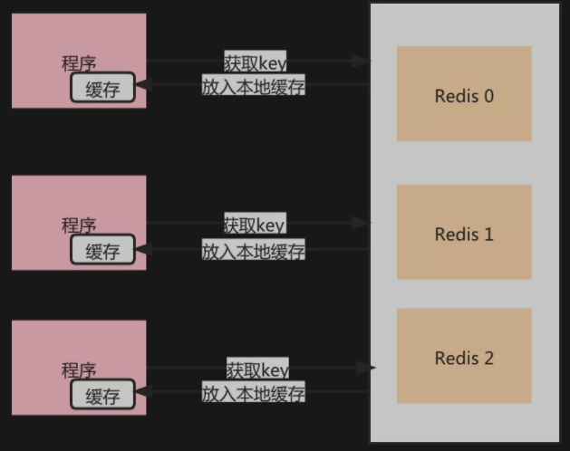
>
>如果用了本地缓存，相信很多读者第一想法就是一致性怎么维护，这个无论是在实际应用中还是面试中都是一个高频的问题。
>
> 还是得从业务场景触发，用缓存的场景肯定就是没有强一致性的要求，能够容忍短暂的不一致。所以在Redis缓存失效或者数据有变更的时候，本地缓存也需要同步清除。
>
> **一般都会采用消息广播的方式进行通知本地缓存失效，因为服务是集群部署的，每个节点上都有一份缓存数据，所以需要广播通知。**
>
>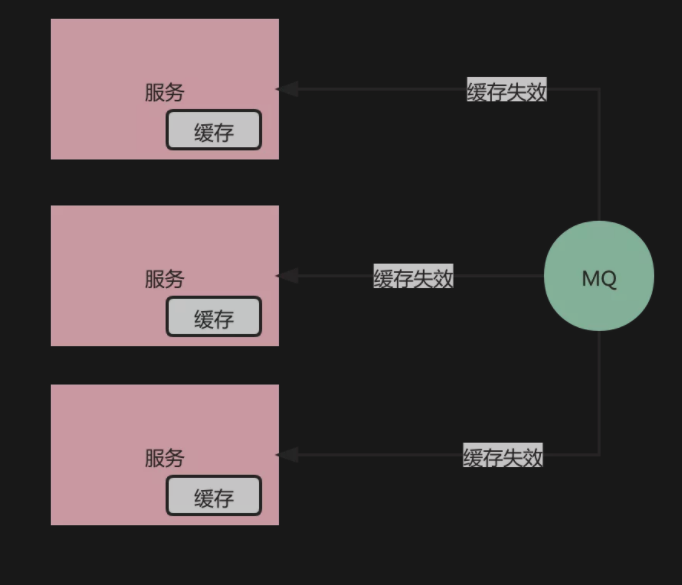
>
>## BigKey的治理
>
>最后要进行BigKey的治理，梳理出来目前已有的BigKey，根据业务场景进行优化。同时在后续使用缓存的场景对缓存内容严格把关，防止出现类似的问题。

